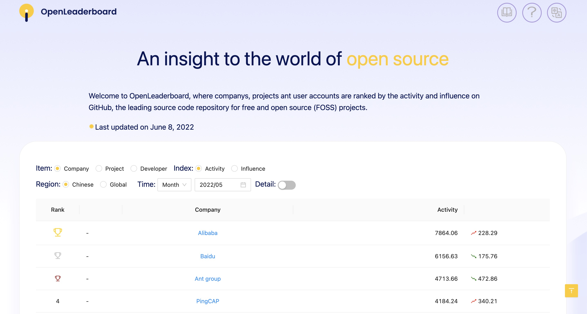
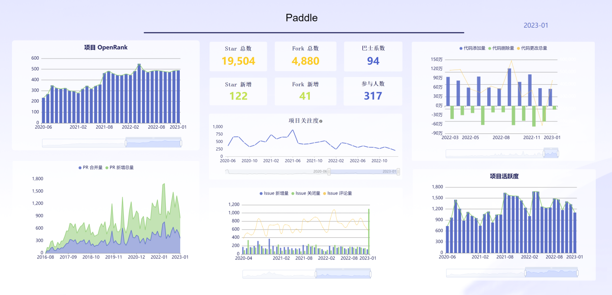

# open-leaderboard

> An insight to the world of open source

Welcome to OpenLeaderboard! This is a web project where companies, projects and developers are ranked by the activity and influence on GitHub.

## Website URL

https://open-leaderboard.x-lab.info/

## About OpenLeaderboard
You can select "Item", "Index", "Region", "Time" and other filters to view different rankings on GitHub.



By clicking on the “Insight board” , you can see the following figure. You can refer to the [OpenDigger Metric](https://github.com/X-lab2017/open-digger#for-repos) for detailed metrics interpretation.



## Contributing
It is warmly welcomed if you have interest to contribute to `open-leaderboard` and help make it  better! The following is a set of guidelines for contributing .

### Submitting an issue

If you have any questions or feature requests, please feel free to [submit an issue](https://github.com/X-lab2017/open-leaderboard/issues/new/choose). Before you submit an issue:

- Please search for related issues. Make sure you are not going to open a duplicate issue.

- Please specify what kind of issue it is and explain it in the title or content, e.g. `feature`, `bug`, `documentation`, `discussion`, `help wanted`... 

To make the issue details as standard as possible, we set up an Issue Template for issue reporters. Please be sure to follow the instructions to fill fields in template.

### Submitting a Pull Request

1. Check the issue list for unresolved issues, choose one you are interested in solving  and reply to  show your willingness to resolve the issue.
2. Proactively communicate with community maintainers under the issue for solutions.
3. Fork and clone the repository to local, and then you can develop the code locally.
4. Run `npm run prettier` to quickly format all your code.
5. Send a pull request on GitHub after you finish developing the code, and wait for the community maintainer to review the code.

To make sure we can easily recap what happened previously, we have prepared a pull request template. You need to fill out the PR template. If you feel that some part of the template is redundant and your description is clear enough, you can just keep the necessary parts.

### Installation

Please make sure that `node v16.x` and `pnpm v8.x` are used in your environment. [nvm](https://github.com/nvm-sh/nvm) is recommended to manage node versions on your machine.

1. clone this project
```
git clone https://github.com/[your_username]/open-leaderboard.git
```

2. install npm packages
```
cd open-leaderboard
pnpm i
```

3. run the project locally
```
pnpm start
```
Runs the app in the development mode.

Open [http://localhost:3000](http://localhost:3000) to view it in the browser. The page will reload if you make edits.

You will also see any lint errors in the console.

4. or build static files
```
pnpm build
```
Builds the app for production to the `build` folder.

It correctly bundles React in production mode and optimizes the build for the best performance.

The build is minified and the filenames include the hashes.

Your app is ready to be deployed!

See the section about [deployment](https://facebook.github.io/create-react-app/docs/deployment) for more information.
